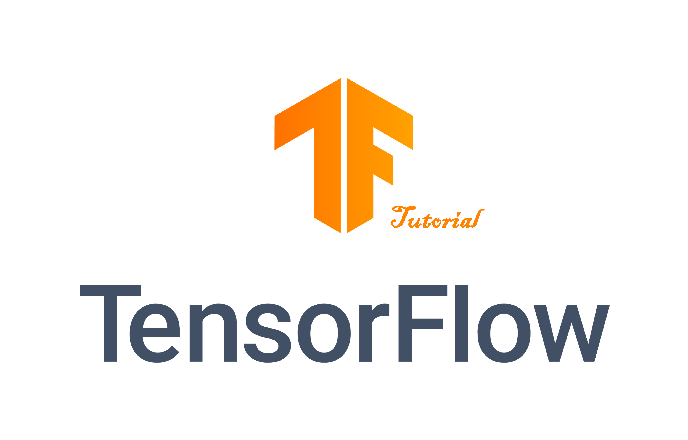
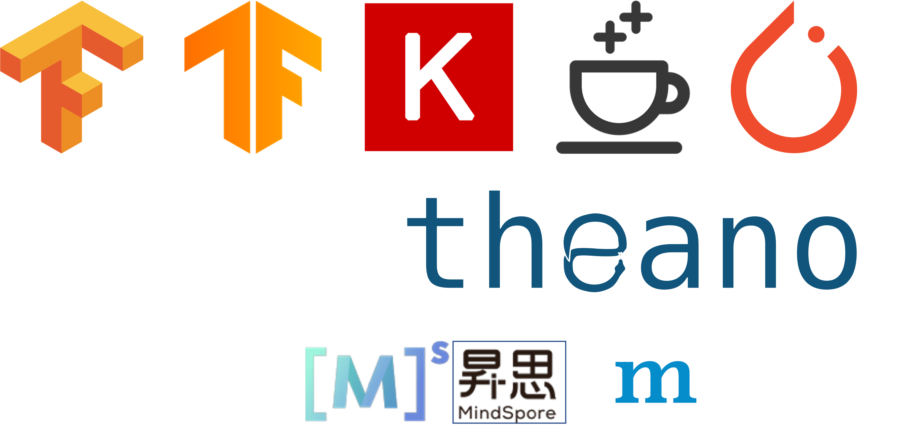
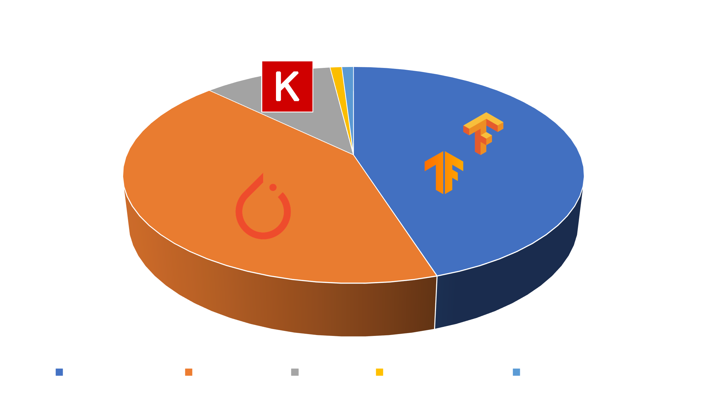
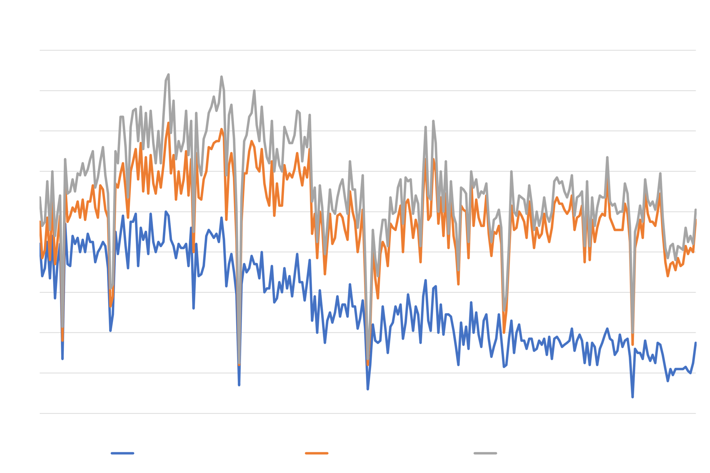
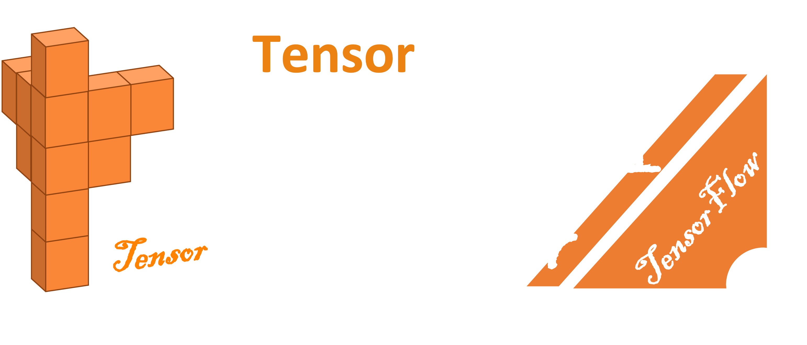
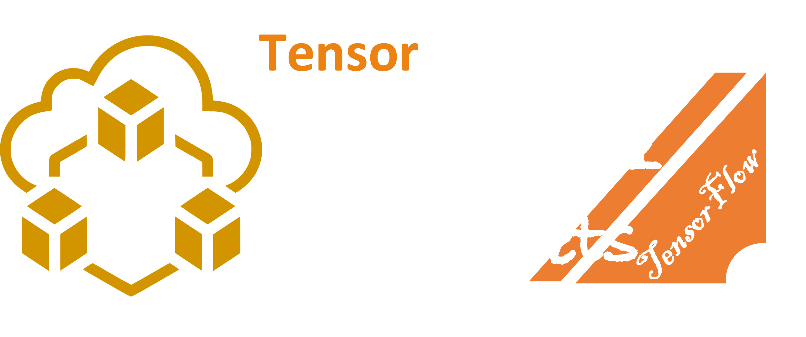
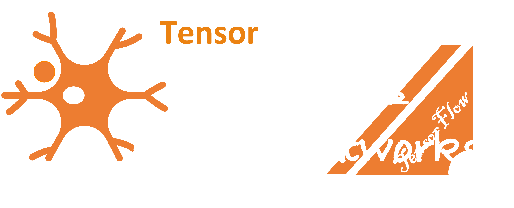

<h1><center>TensorFlow 2 Tutorial</center></h1>
<center></center>

<div align="center">
    <div style="color: #EF7731;">
    	<h3>
        	TensorFlow 2指东南西北
        </h3>
    </div>
    
</div>


## TensorFlow 2 简介

TensorFlow官网：[TensorFlow Official](https://tensorflow.org)

TensorFlow Github: [TF Github](https://github.com/tensorflow/tensorflow)

TensoorFlow是一个深度学习框架。TensorFlow框架的前身是Google的DistBelief V2，是谷歌大脑项目的深bai度网络工具库，一些人认为TensorFlow是借鉴Theano重构的。首先目前面临比较麻烦的事情是版本分裂严重，2.0推出之后到2.4之间的版本几乎不可用，接口变更太多，runtime效率比1.X普遍损失50%左右的性能。另外缺少符号循环，当我们说可变长度序列时, 更需要该功能。不幸的是, TensorFlow不提供功能，但是有限折叠可以解决这个问题。好处是有着庞大的维护团队，看看Google AI blog 每个月好几篇AI创新文章，基本上都是基于Tensorflow开发，另外还提供富有挑战性的数据集挑战赛。TensorFlow更适合大规模部署，特别是需要跨平台和嵌入式部署。

TensorFlow目前主要使用的是两个版本，分别是1.x和2.x。除了TensorFlow外，还有很多深度学习框架和工具，如下图所示：



以上是使用范围比较广或比较新的深度学习工具和框架，还有其他小众的一些工具比如DarkNet没有列在其中。上图中第一张图和第二张图分别是TF1和TF2，他们有非常大的差别。TF1使用一种比较特殊的语言风格，和设计电路的方式类似，先设计电路图，再给电路通电，得到结果。TF1并没有使用Python原生的语法，使开发者使用起来非常的不愉快。TF2一直到2.4之前虽然API得到了很大的优化，但是性能相比较之前降低了50%之多。无论是TF1和TF2，都绕不开计算图的概念，这个概念在TF2中有意识的隐去，让开发者更加能够面向Python进行开发深度学习。

另外，不得不提的是Keras。Keras在Tensorflow中的角色比较复杂。Keras是作为一个高级API存在的，它可以指定运行的后台，比如以前的Keras中，可以选取是使用Tensorflow还是Theano，后来Theano再也不更新维护了，并且Keras被Google给收购了，所以目前可以认为Tensorflow和Keras是一体的互相分不开的，至于你是使用`tf.keras`还是`keras`的API，目前已经无关紧要。在Keras官网文档中，所有API介绍和示例均已使用Tensorflow的`tf.keras`。但是虽然Keras作为高级API，但是依旧依赖于Tensorflow的版本，所以当需要更加复杂、高级的应用时，还是会使用Tensorflow原生的API。目前搭建神经网络时都适用的是`tf.keras.layers`中的API。总之，TF的API混乱是不管什么时候都会被人诟病。

目前另外一大深度学习框架就是Pytorch，它早起是使用Lua语言编写的，由于Lua的小众，Facebook并没有很好的推广。Pytorch的后台也是使用C++编写的，就是Caffe2，结合C++的性能和Python友好接口，成为了目前非常流行的深度学习框架。Pytorch适合实验室和科研开发，而且业发展出了很多优秀的周边社区，比如Pytorch Lighting，OpenMMLab等。

Deeplearning4j是一个Java的深度学习框架，通过Scala语言实现的Spark大数据处理框架结合使用。

在国内，目前华为的Mindspore和百度的PaddlePaddle是冉冉升起的新深度学习框架，并结合了各自的硬件平台，非常具有发展前景，但是目前仍然处于初步探索阶段。

对于纷繁复杂的深度学习工具的选择，可以参考Google Trend的报告：

<center></center>

<center></center>

### 前置知识

本教程虽然是指南，但是主要针对于全面的TF 2 API进行梳理和使用练习，因此需要伙伴们有一点前置知识：

1. Python编程语言：TF的接口主要使用Python作为前端，面向开发者的，所以需要大家比较熟悉Python编程语言。具体地，您需要掌握几乎所有的语法和各种内置的一些库，面向对象，函数式编程思想等。比如`os`，`glob`，`time`，`sys`等。
2. Python的一些第三方库：除了Python的内置的库外，还需要掌握一些第三方库，包括但不限于
   - Numpy：Numpy在机器学习和科学计算中的地位不言而喻，很多其他语言的不友好的根源有的时候就是因为没有统一的，深入人心的多维数组和线性代数等API接口。
   - Matplotlib：一个MATLAB中绘图模块的逆向工程，该库可以可视化几乎所有的图表，也是非常重要的科学计算工具。
   - Scikit-Learn：一个机器学习框架，智能使用CPU，但是其API设计和相关模块算法非常具有权威，学习了Scikit-Learn后，很多其他的库学习起来就非常的简单。
   - Pandas：Pandas是处理结构化数据的有力工具，在处理结构化数据处理方面比Numpy要强大地多。在深度学习领域用的不是特别多，但是有些地方还不能被代替。
   - OpenCV：图像处理和图像识别是入门深度学习和掌握深度学习的必经之路，所以图像处理库OpenCV非常的具有影响力，它有C++版本和Python版本，非常的容易上手，但是需要了解很多图像的算法。
   - ...
3. 数学知识：机器学习，包括蛇毒学习多多少少还是需要一些数学知识的，包括微积分、概率论等。
4. 数字图像处理：对于冈萨雷斯的《数字图像处理》的前4章有一定的认识。

### Tensorflow安装

GPU版本安装

```shell
pip install tensorflow-gpu
```

安装GPU版本必须保证您的机器需要有NVIDIA显卡驱动，可以使用

```shell
nvidia-smi
```

进行测试。除此之外，需要安装和配置CUDA和CUDnn，若您使用最新版本的Tensorflow，可以安装最新的CUDA和CUDnn版本。安装完成之后，可以使用

```python
import tensorflow as tf
print(tf.test.is_gpu_available())
```

方式测试。当打印`True`后，表明您的CUDA环境是没有问题的，若返回`False`，可以通过日志查看是缺少了哪些库（`.so`或`.dll`），并重新安装对应版本即可。


CPU版本

```shell
pip install tensorflow-cpu
```

在学习之初，CPU版本的TensorFlow就可以满足需求了。

## 目录（Contents）

[第一章：张量（Tensor）](https://github.com/Meimin-Wang/Tensorflow-2_Tutorial/blob/main/第一章%20张量（Tensor）/README.md)



张量是一种数据容器，它和Numpy中的ndarray，Python中的list的角色比较类似。受限于TF的独特应用场景和运行环境，TF中的张量与Numpy中的多维数组略有不同。

TODO：张量视频

[第二章：数据集（Datasets）](https://github.com/Meimin-Wang/Tensorflow-2_Tutorial/tree/main/第二章%20数据集（Datasets）)



第三章：神经网络（Neural Network）



