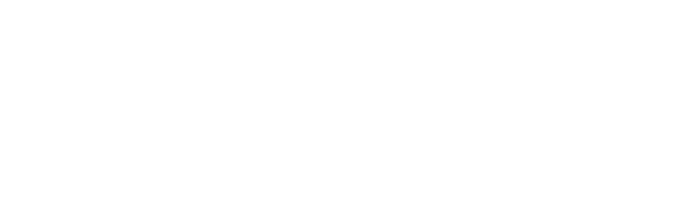
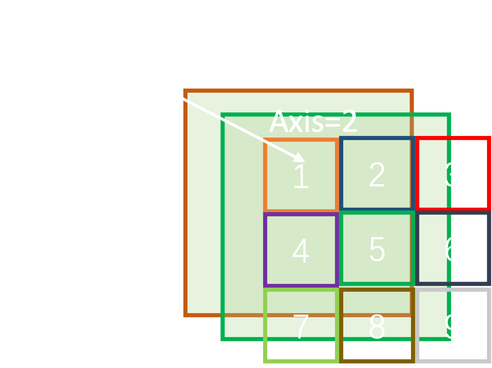
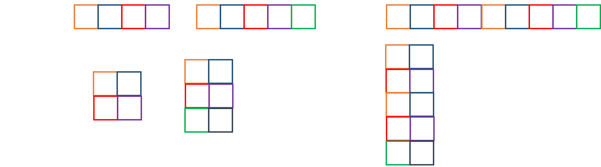
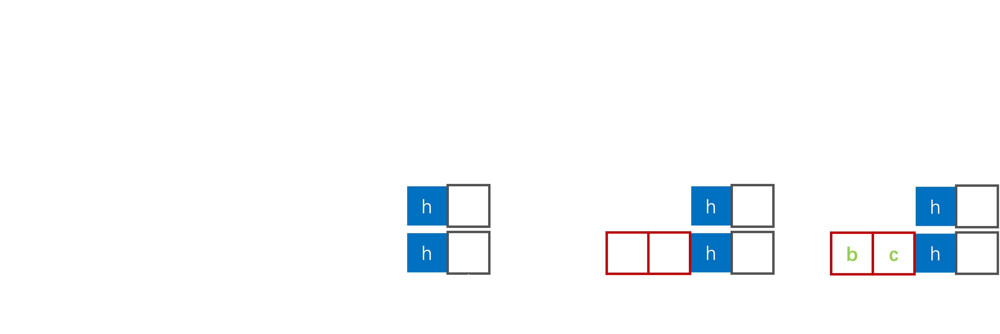
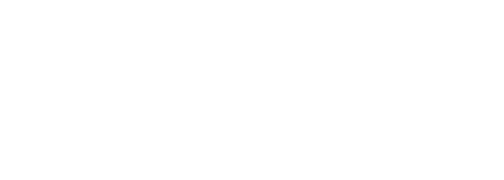
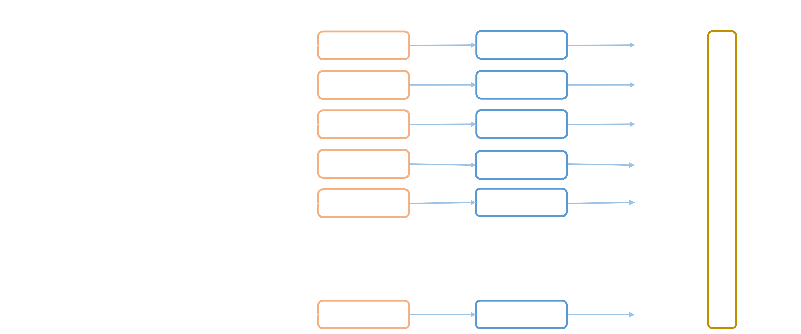
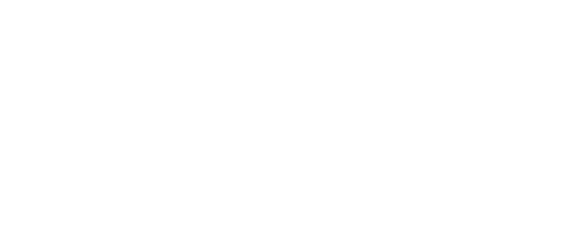

# TensorFlow 2

## 1. Tensor

Tensor是各个深度学习框架中的核心数据结构，它用来表示高维数组。

### 1.1 张量创建

张量是一种Tensorflow特有的数据容器。创建张量和在Python中创建`list`，`tuple`等本质是一致的。

- `def constant(value, dtype=None, shape=None, name="Const")`

  - `value`：张量的内容，可以是Python中的类型，也可以是Numpy中的类型
  - `dtype`：数据类型，可以从`tf.dtypes`中寻找需要的数据类型
  - `name`：张量的名称，实际是一个操作的名称

  示例：

  ```python
  import numpy as np
  import tensorflow as tf
  
  # 传入一个普通的数值
  x = tf.constant(1.2)
  tf.print(x)
  
  # 传入一个Python list
  x = tf.constant([2, 3.2, 4])
  tf.print(x)
  
  # 传入一个Python tuple
  x = tf.constant((1, 2, 3))
  tf.print(x)
  
  # 传入一个Numpy的ndarray数组
  x = tf.constant(np.array([1, 2, 3]))
  tf.print(x)
  ```

  这里需要注意的是：

  1. `dtype`指定后，如果类型不匹配的话是会跑出异常的，例如以下代码：

     ```python
     x = tf.constant([1, 2, 3.2], dtype=tf.int32)  # 因为3.2是浮点型，但是dtype是整型不能进行强制转换
     ```

  2. 不能够在定义Tensor后，是不能够获取一些属性的，比如`name`，`op`等属性的，因为此时使用的Eager Excution模式。

     ```python
     x_name = x.name
     
     AttributeError: Tensor.name is undefined when eager execution is enabled.
     ```

     在计算图模式：

     ```python
     @tf.function
     def f():
         x = tf.constant([1, 2, 3])
         print(x.name)
     f()
     ```

     输出：

     ```shell
     Const:0
     ```

- 创建特殊的张量

  1. `def ones(shape, dtype=dtypes.float32, name=None)`
  2. `def zeros(shape, dtype=dtypes.float32, name=None)`
  3. `def fill(dims, value, name=None)`
  4. `def eye(num_rows, num_columns=None, batch_shape=None, dtype=dtypes.float32, name=None)`
  5. `def linspace_nd(start, stop, num, name=None, axis=0)`
  6. `def range(start, limit=None, delta=1, dtype=None, name="range")`

  例如：

  ```python
  import tensorflow as tf
  
  x = tf.ones(shape=[2, 3])
  print(x)
  
  x = tf.zeros(shape=[3, 2])
  print(x)
  
  x = tf.fill([2, 2], 3.3)
  print(x)
  
  x = tf.eye(2)
  print(x)
  
  x = tf.linspace(0, 100, 5)
  print(x)
  
  x = tf.range(0, 100, 2)
  print(x)
  ```

  输出：

  ```shell
  tf.Tensor(
  [[1. 1. 1.]
   [1. 1. 1.]], shape=(2, 3), dtype=float32)
  tf.Tensor(
  [[0. 0.]
   [0. 0.]
   [0. 0.]], shape=(3, 2), dtype=float32)
  tf.Tensor(
  [[3.3 3.3]
   [3.3 3.3]], shape=(2, 2), dtype=float32)
  tf.Tensor(
  [[1. 0.]
   [0. 1.]], shape=(2, 2), dtype=float32)
  tf.Tensor([  0.  25.  50.  75. 100.], shape=(5,), dtype=float64)
  tf.Tensor(
  [ 0  2  4  6  8 10 12 14 16 18 20 22 24 26 28 30 32 34 36 38 40 42 44 46
   48 50 52 54 56 58 60 62 64 66 68 70 72 74 76 78 80 82 84 86 88 90 92 94
   96 98], shape=(50,), dtype=int32)
  ```

- 复制张量`xxx_like`

- 随机张量，在`tf.random`模块下

  1. `def def random_normal(shape, mean=0.0, stddev=1.0 dtype=dtypes.float32, seed=None, name=None)`

     该函数可以生成一个服从正态随机分布的张量，概率密度函数为
     $$
     f(x;\boldsymbol{\mu,\Sigma})=\frac{1}{\left(2\pi\right)^{\frac{n}{2}}\left|\boldsymbol \Sigma\right|^{\frac12}}e^{-\frac12 \left( \left(\boldsymbol X-\boldsymbol \mu\right)^\top\boldsymbol\Sigma^{-1}\left(\boldsymbol X-\boldsymbol \mu\right) \right)}
     $$

     ```python
     import tensorflow as tf
     
     x = tf.random.normal([5, 5])
     print(x)
     ```

     输出：

     ```shell
     tf.Tensor(
     [[ 1.0284482  -0.06882296  0.57281095 -0.52652025  1.002363  ]
      [ 1.5339344  -0.4890544  -1.8685299   1.0711784   2.169645  ]
      [-0.10586395 -0.7577186  -1.0247724   0.21309386 -0.6320886 ]
      [-1.4260643  -0.6839064   0.8648016  -0.18941845  0.14517523]
      [-0.60574925 -0.72606707 -1.0409023   0.38468215  2.2940114 ]], shape=(5, 5), dtype=float32)
     ```

  2. `def truncated_normal(shape, mean=0.0, stddev=1.0 dtype=dtypes.float32, seed=None, name=None)`：截断的正态分布

  3. `def random_uniform(shape, mean=0.0, stddev=1.0 dtype=dtypes.float32, seed=None, name=None)`：均匀分布

  4. `def random_poisson(lam, shape, dtype=dtypes.float32, seed=None, name=None)`

  5. ……

在创建张量的过程中通常需要指定一个名字，也就是`name`参数，这本质上和Python或Numpy中创建一个数据容器是有区别的，实际上我们创建的是一个操作（或者叫做算子op），而我们在Eager Excution的模式下可以立即执行得到结果的，具体地可以查看`tf.Tensor`源代码：

```python
class Tensor:
    """A `tf.Tensor` represents a multidimensional array of elements.

  All elements are of a single known data type.

  When writing a TensorFlow program, the main object that is
  manipulated and passed around is the `tf.Tensor`.

  A `tf.Tensor` has the following properties:

  * a single data type (float32, int32, or string, for example)
  * a shape

  TensorFlow supports eager execution and graph execution.  In eager
  execution, operations are evaluated immediately.  In graph
  execution, a computational graph is constructed for later
  evaluation.

  TensorFlow defaults to eager execution.  In the example below, the
  matrix multiplication results are calculated immediately.
  """
  def __init__(self, op, value_index, dtype):
    ...
```

由于计算图的存在，实际上我们在定义张量的时候是不能得到这个张量的值的，因为定义知识一个图纸的设计，而得到张量的值需要运行整个计算图才能获取，比如在Tensorflow 1.x版本中，计算图的定义和运行时分开的，这当然非常不利于调试。在Tensorflow 2中，有了Eager Excution模式，所以能够时刻地得到定义的张量的值，这也大大降低了性能。

说起计算图，在这里进行抛砖引玉，我们虽然利用Python的思维逻辑去创建了一个张量，看似没有任何问题，实际上是做了一个运算，意义是大不相同的，以下两行代码：

```python
x = [1, 2, 3]
x = tf.constant([1, 2, 3])
```

要说清楚的是，通常使用的`tf.xxx`都是一种操作（算子，Operation），包括`constant`，`range`，`ones`等。计算图是一个图（Graph）结构，它有两个概念：

- 节点（Node）：节点就是操作
- 边（Edge）：边可以看作是数据（当然不仅仅是数据，还有控制流）

计算图（Computational Graph）又是一种特殊的数据流图（Data Flow Graph），而这个数据就是张量（Tensor），所以这个框架的名字叫做TensorFlow。作为一个有向图，节点自然有入边和出边了，可以看作是函数的输入和输出，而多个节点也构成了一个新的图，就是子图，一个子图也有输入边和输出边，慢慢就汇聚成了一个大的计算图。

### 1.2 张量的操作

张量的操作就是计算图中的节点。这里主要总结一些著名的，常用的一些操作。



张量的操作非常多，弃用有一类就是element-wise操作，就是对张量中的每个元素进行操作，有一元操作，二元操作和多元操作，可以用如下公式描述
$$
\boldsymbol O=f\left(
\boldsymbol{T_1,T_2,\cdots}
\right)
$$
此时，操作的结果通常与输入的形状（shape）是相同的，看如下例子：

```python
import tensorflow as tf

x = tf.constant([[1, 2], [3, 4]], dtype=tf.float32)
y = tf.constant([[10, 20], [30, 40]], dtype=tf.float32)
# Python运算符
z = -x  # 注意：没有 y = +x
print(z)
z = x + y # 除了+，还有 - * / // % += -= *= /= < > <= >= != ==
print(z)
x = tf.constant([[1, 2], [3, 4]], dtype=tf.int32)
y = tf.constant([[10, 20], [30, 40]], dtype=tf.int32)
z = x & y # & | ~ ^ 没有移位运算符
print(z)
```

以上的一些操作和普通Python操作或Numpy的操作方式类似，个别是需要注意的，但是总的来说没有什么特殊的。

除了运算符，还有很多运算函数，比如Python内置的`abs`，`pow`等，也是和普通的Python函数类似，这些函数作用在张量的每个元素上。

除了built-in的函数，还有很多数学操作，三角函数等，都在`tf.math`包下：

- `tf.math.abs`

- `tf.math.accumulate_n`：累加多个张量

  ```python
  import tensorflow as tf
  
  x = tf.constant([[-2, 1], [2.3, -4]], dtype=tf.float32)
  y = tf.constant([[1, 2], [3, 4]], dtype=tf.float32)
  z = tf.constant([[10, 20], [30, 40]], dtype=tf.float32)
  
  res = tf.math.accumulate_n([x, y, z])
  print(res)
  ```

- 三角函数：`sin`，`cos`，`tan`，`asin`，`acos`，`atan`，`asinh`，`acosh`，……

- `tf.math.angle`：计算复数的俯角$\theta$
  $$
  a+bi\Rightarrow \theta=\text{atan2}(b,a)
  $$
  其中$\text{atan2}(\cdot)$为
  $$
  \text{atan2}(y,x)=\left\{
  \begin{aligned}
  	&\arctan\left(\frac yx\right)&,&x>0\\
  	&\arctan\left(\frac yx\right)+\pi&,&y\ge 0,x<0\\
  	&\arctan\left(\frac yx\right)-\pi&,&y<0,x<0\\
  	&+\frac{\pi}{2}&,&y>0,x=0\\
  	&-\frac{\pi}{2}&,&y<0,x=0\\
  	&\text{undefined}&,&x=0,y=0
  \end{aligned}
  \right.
  $$

- `tf.math.bassel_i0e`：贝塞尔值
  $$
  i0e(x)=e^{-{\left|x\right|}}*i0(x)
  $$
  其中$i0(\cdot)$为
  $$
  I_0(x)=\sum_{k=0}^\infty\frac{\left(x^2/4\right)^k}{\left(k!\right)^2}=J_0(ix)
  $$
  参考：[SciPy](https://docs.scipy.org/doc/scipy/reference/generated/scipy.special.i0.html#scipy.special.i0) [Wiki](https://en.wikipedia.org/wiki/Bessel_function)

- `tf.math.betainc`：计算Beta积分
  $$
  I_x(a, b)=\frac{\displaystyle\int_0^xt^{a-1}(1-t)^{b-1}dt}{\displaystyle\int_0^\infty t^{a-1}\left(1-t\right)^{b-1}}
  $$

- `tf.math.bincount`：统计每个整型数值的个数

  ```python
  import tensorflow as tf
  
  x = tf.constant([2, 3, 5, 3, 5, 2, 3, 3, 4], dtype=tf.int32)
  y = tf.math.bincount(x)  # ==> 0:0 1:0 2:2 3:4 4:1 5:2
  ```

- `tf.math.ceil`，`floor`：取整函数

- `tf.math.conj`：共轭操作

- `tf.math.count_nonzero`：非0元素的个数

  ```python
  import tensorflow as tf
  
  x = tf.constant([2, 3, 0, 0, 5, 0, 0, 0, 4], dtype=tf.int32)
  y = tf.math.count_nonzero(x)  # 4
  ```

- `tf.math.cumprod`：元素连乘
  $$
  \text{cumprod}\left(x_1, x_2,x_3,\cdots,x_n\right)=\left[
  \begin{matrix}
  	x_1&x_1x_2&x_1x_2x_3&\cdots&\displaystyle\prod_{k=1}^ix_k &\cdots &\displaystyle\prod_{k=1}^nx_k
  \end{matrix}
  \right]
  $$

  ```python
  import tensorflow as tf
  x = tf.constant([[1, 2, 3], [4, 5, 6]], dtype=tf.float32)
  y = tf.math.cumprod(x, axis=0)
  print(y)
  y = tf.math.cumprod(x, axis=1)
  print(y)
  ```

  输出：

  ```shell
  tf.Tensor(
  [[ 1.  2.  3.]
   [ 4. 10. 18.]], shape=(2, 3), dtype=float32)
  tf.Tensor(
  [[  1.   2.   6.]
   [  4.  20. 120.]], shape=(2, 3), dtype=float32)
  ```

  这里的轴（axis）的概念之后总结。

- `tf.math.cumsum`：元素累加
  $$
  \text{cumsum}\left(x_1, x_2, \cdots,x_n\right)=\left[
  \begin{matrix}
  x_1&x_1+x_2&\cdots&\displaystyle\sum_{k=1}^ix_k&\cdots&\displaystyle\sum_{k=1}^nx_k
  \end{matrix}
  \right]
  $$

- `tf.math.cumulative_logsumexp`
  $$
  \text{cumulative\_logsumexp}\left(x_1, x_2, \cdots,x_n\right)=\left[
  \begin{matrix}
  \log e^{x_1}& \log\left(e^{x_1}+e^{x_2}\right) &\cdots&\displaystyle\log\sum_{k=1}^ie^{x_k}&\cdots&
  \displaystyle\log\sum_{k=1}^ne^{x_k}
  \end{matrix}
  \right]
  $$

- `tf.math.digamma`：Psi函数
  $$
  \psi\left(x\right)=\frac{d}{dx}\ln\left(\Gamma(x)\right)=\frac{\Gamma'(x)}{\Gamma(x)}\sim \ln x-\frac1{2x}
  $$

- `tf.math.erf`：
  $$
  \text{erf}\left(x\right)=\frac{2}{\sqrt[]{\pi}}\int_0^xe^{-t^2}dt
  $$

- `tf.math.erfc`：
  $$
  \text{erfc}(x)=1-\text{erf}(x)=\frac{2}{\sqrt[]{\pi}}\int_x^\infty e^{-t^2}dt
  $$

- `tf.math.expm`：
  $$
  \text{expm}(x)=e^x - 1
  $$

- `tf.math.igammac`和`tf.math.igamma`：Lower Gamma和Upper Gamma
  $$
  P(a,x)=\frac{\Gamma(a,x)}{\Gamma(a)}=1-Q(a,x)
  $$

- `tf.math.is_non_decreasing`：是否非递减序列
  $$
  \text{is\_non\_decreasing}(x_1,x_2,\cdots,x_n)=\mathbb I(x_i<x_j),\ \forall i,j, i \le j
  $$

  ```python
  import tensorflow as tf
  
  x = tf.constant([2, 3, 3, 4, 5, 7])
  y = tf.math.is_non_decreasing(x)  # ==> True
  x = tf.constant([2, 3, 3, 4, 2, 7])
  y = tf.math.is_non_decreasing(x)  # ==> False
  ```

- `tf.math.is_strictly_increasing`

- `tf.math.lbeta`：$\ln\left(|Beta(x)|\right)$

- `tf.math.lgamma`：$ln\left(|Gamma(x)|\right)$

- `tf.math.log`：$\log(x)$

- `tf.math.log1p`：$\log(1+x)$

- ……

以上就是一些数学`tf.math`中的一些函数，但是这里还有一些函数故意跳过的，需要在后面再单独详细讲解和总结，以上有很多数学中的函数，实际上使用到的非常少。

张量中又个非常重要的操作，那就是两个张量相乘。矩阵乘法，假设有矩阵$\boldsymbol A\in\mathbb R^{m\times p}$和矩阵$\boldsymbol B\in\mathbb R^{s\times n}$，乘法规则如下：
$$
[c_{ij}]=\sum_{k=1}^pa_{ik}b_{kj}
$$

Tensorflow采用`@`运算符对矩阵乘法进行实现，自然也可以通过调用API进行使用

```python
import tensorflow as tf

A = tf.constant([
    [3, 2, 1],
    [1, 4, 6]
])

B = tf.constant([
    [10, 32],
    [14, 11],
    [13, 8]
])

print(A @ B)
print(tf.matmul(A, B))
```

输出：

```shell
tf.Tensor(
[[ 71 126]
 [144 124]], shape=(2, 2), dtype=int32)
tf.Tensor(
[[ 71 126]
 [144 124]], shape=(2, 2), dtype=int32)
```

在张量的运算中为了减少类型转换带来的开销，通常需要操作的多个张量之间的类型要保持一致，类型属性相关操作在`tf.dtypes`包下，例如：

```python
import tensorflow as tf

x = tf.constant([1, 2, 3], dtype=tf.int32)
y = tf.constant([1, 2, 3], dtype=tf.float32)

# Error
# print(x + y)

y = tf.cast(y, tf.int32)
print(x + y)
```

### 1.3 Tensor形状

Tensor中有一个非常关键的属性，就是**形状（shape）**，在内存中，所有的N维数组（张量）都是一个一维数组，所以，形状是Tensor的一种**视图（view）**。

首先关注下张量中轴的概念：



```python
import tensorflow as tf

x = tf.constant(1.2)
tf.print('shape:', x.shape, 'rank:', tf.rank(x), 'size:', tf.size(x))
x = tf.constant([1, 2, 3, 4, 5])
tf.print('shape:', x.shape, 'rank:', tf.rank(x), 'size:', tf.size(x))
x = tf.constant([[1, 2], [3, 4]])
tf.print('shape:', x.shape, 'rank:', tf.rank(x), 'size:', tf.size(x))

```

输出：

```shell
shape: TensorShape([]) rank: 0 size: 1
shape: TensorShape([5]) rank: 1 size: 5
shape: TensorShape([2, 2]) rank: 2 size: 4
```

- `shape`：返回一个`TensorShape`类型的张量
- `rank`：是维度，数值是0维
- `size`：张量中的元素的数量

有很多操作会影响形状

- `tf.reshape`：

  ```python
  import tensorflow as tf
  
  x = tf.range(16)
  print(x.shape)  # (16, )
  x = tf.reshape(x, (4, 4))
  print(x.shape)  # (4, 4)
  x = tf.reshape(x, (2, 8))
  print(x.shape)  # (2, 8)
  x = tf.reshape(x, (2, 2, 4))
  print(x.shape)  # (2, 2, 4)
  ```

- 维度扩张

  ```python
  import tensorflow as tf
  
  x = tf.reshape(tf.range(16), (4, 4))
  print(x.shape) # ==> (4, 4)
  y = tf.expand_dims(x, 0)
  print(y.shape) # ==> (1, 4, 4)
  y = tf.expand_dims(x, 1)
  print(y.shape) # ==> (4, 1, 4)
  ```

- 维度压榨

  ```python
  import tensorflow as tf
  
  x = tf.reshape(tf.range(16), (4, 4, 1, 1))
  print(x.shape) # ==> (4, 4, 1, 1)
  y = tf.squeeze(x)
  print(y.shape)
  ```

- `tf.repeat`：重复张量沿着某个轴（axis）

  

  ```python
  import tensorflow as tf
  
  x = tf.reshape(tf.range(16), (4, 4))
  print(x)
  y = tf.repeat(x, repeats=[2, 2, 1, 3], axis=0)
  print(y)
  ```

  输出：【解释】`axis=0`从上往下开始复制，2次、2次、1次、3次，所以此时`y.shape == (2+2+1+3, x.shape[1])`，即`y.shape=(8, 4)`

  ```shell
  tf.Tensor(
  [[ 0  1  2  3]
   [ 4  5  6  7]
   [ 8  9 10 11]
   [12 13 14 15]], shape=(4, 4), dtype=int32)
  tf.Tensor(
  [[ 0  1  2  3]
   [ 0  1  2  3]
   [ 4  5  6  7]
   [ 4  5  6  7]
   [ 8  9 10 11]
   [12 13 14 15]
   [12 13 14 15]
   [12 13 14 15]], shape=(8, 4), dtype=int32)
  ```

- 张量连接`tf.concat`

  

  ```python
  import tensorflow as tf
  x = tf.random.normal([2, 2])
  y = tf.random.normal([4, 2])
  
  z = tf.concat([x, y], axis=0)
  print(z.shape)  # ==> (6, 2) 沿着第一个轴（从上而下）进行拼接
  ```

  【注意】`tf.concat`是不改变张量的`rank`

- 张量堆耋`tf.stack`

  ```python
  import tensorflow as tf
  x = tf.random.normal([3, 3])
  y = tf.random.normal([3, 3])
  
  z = tf.stack([x, y], axis=0)
  print(z.shape) # ==> (2, 3, 3)
  
  z = tf.stack([x, y], axis=1)
  print(z.shape) # ==> (3, 2, 3)
  ```

- `tf.tile`

  ```python
  import tensorflow as tf
  
  x = tf.constant([[1, 2, 3], [4, 5, 6]])
  
  y = tf.tile(x, tf.constant([2, 3]))
  
  print(y)
  ```

  输出：

  ```shell
  tf.Tensor(
  [[1 2 3 1 2 3 1 2 3]
   [4 5 6 4 5 6 4 5 6]
   [1 2 3 1 2 3 1 2 3]
   [4 5 6 4 5 6 4 5 6]], shape=(4, 9), dtype=int32)
  ```

- `tf.pad`

  ```python
  import tensorflow as tf
  
  x = tf.constant([[1, 2, 3], [4, 5, 6]])
  
  y = tf.pad(x, tf.constant([[1, 1], [2, 2]]), mode='constant', constant_values=100)
  print(y)
  
  y = tf.pad(x, tf.constant([[1, 0], [1, 2]]), mode='reflect')
  print(y)
  
  y = tf.pad(x, tf.constant([[2, 2], [0, 1]]), mode='symmetric')
  print(y)
  ```

  输出：

  ```shell
  tf.Tensor(
  [[100 100 100 100 100 100 100]
   [100 100   1   2   3 100 100]
   [100 100   4   5   6 100 100]
   [100 100 100 100 100 100 100]], shape=(4, 7), dtype=int32)
  tf.Tensor(
  [[5 4 5 6 5 4]
   [2 1 2 3 2 1]
   [5 4 5 6 5 4]], shape=(3, 6), dtype=int32)
  tf.Tensor(
  [[4 5 6 6]
   [1 2 3 3]
   [1 2 3 3]
   [4 5 6 6]
   [4 5 6 6]
   [1 2 3 3]], shape=(6, 4), dtype=int32)
  ```

- `tf.transpose`：维度变换

  ```python
  import tensorflow as tf
  
  x = tf.range(30)
  x = tf.reshape(x, (1, 5, 2, 3))
  print(x.shape)
  #                      0  1  2  3
  #                      1  5  2  3
  print(tf.transpose(x, [1, 2, 0, 3]).shape)
  #                      5, 2, 1, 3
  ```

  输出：

  ```shell
  (1, 5, 2, 3)
  (5, 2, 1, 3)
  ```

  

### 1.4 Tensor索引

TensorFlow中的Tensor索引和Numpy索引几乎一致。

举例：

```python
import tensorflow as tf

x = tf.range(30)
x = tf.reshape(x, (5, 6))
print(x)

# 取某个值
print(x[0][0])
print(x[0, 0])

# 取某一行
print(x[0])
print(x[0, :])

# 取某一列
print(x[:, 0])

# 取连续的几行 （列同理）
print(x[2:4, :]) # 2, 3两行
print(x[1:, :])  # 取1, 2, 3, 4四行
print(x[:3, :])  # 取0，1，2三行

# 取不连续的行（列同理）
print(x[1::2, :]) # 取1，3两行
print(x[::-1, :]) # 倒过来取行 4，3，2，1，0
print(x[4:1:-1, :])  # 取4，3，2三行

# 取子矩阵
print(x[1:3, 2:4])  # 取 1，2两行，2，3两列，一个2x2的子矩阵
```

输出：

```shell
tf.Tensor(
[[ 0  1  2  3  4  5]
 [ 6  7  8  9 10 11]
 [12 13 14 15 16 17]
 [18 19 20 21 22 23]
 [24 25 26 27 28 29]], shape=(5, 6), dtype=int32)
tf.Tensor(0, shape=(), dtype=int32)
tf.Tensor(0, shape=(), dtype=int32)
tf.Tensor([0 1 2 3 4 5], shape=(6,), dtype=int32)
tf.Tensor([0 1 2 3 4 5], shape=(6,), dtype=int32)
tf.Tensor([ 0  6 12 18 24], shape=(5,), dtype=int32)
tf.Tensor(
[[12 13 14 15 16 17]
 [18 19 20 21 22 23]], shape=(2, 6), dtype=int32)
tf.Tensor(
[[ 6  7  8  9 10 11]
 [12 13 14 15 16 17]
 [18 19 20 21 22 23]
 [24 25 26 27 28 29]], shape=(4, 6), dtype=int32)
tf.Tensor(
[[ 0  1  2  3  4  5]
 [ 6  7  8  9 10 11]
 [12 13 14 15 16 17]], shape=(3, 6), dtype=int32)
tf.Tensor(
[[ 6  7  8  9 10 11]
 [18 19 20 21 22 23]], shape=(2, 6), dtype=int32)
tf.Tensor(
[[24 25 26 27 28 29]
 [18 19 20 21 22 23]
 [12 13 14 15 16 17]
 [ 6  7  8  9 10 11]
 [ 0  1  2  3  4  5]], shape=(5, 6), dtype=int32)
tf.Tensor(
[[24 25 26 27 28 29]
 [18 19 20 21 22 23]
 [12 13 14 15 16 17]], shape=(3, 6), dtype=int32)
tf.Tensor(
[[ 8  9]
 [14 15]], shape=(2, 2), dtype=int32)
```

除了`:`的使用，还有两个重要的符号：

- `...`
- `tf.newaxis`

举例：

```python
import tensorflow as tf

x = tf.range(30)
x = tf.reshape(x, (2, 3, 5))
print(x)

# 取最后一个轴第一个，形状应该是 2, 3
print(x[..., 0])

# tf.newaxis增加一个轴
print(x[tf.newaxis, ...].shape)
```

输出：

```shell
tf.Tensor(
[[[ 0  1  2  3  4]
  [ 5  6  7  8  9]
  [10 11 12 13 14]]

 [[15 16 17 18 19]
  [20 21 22 23 24]
  [25 26 27 28 29]]], shape=(2, 3, 5), dtype=int32)
tf.Tensor(
[[ 0  5 10]
 [15 20 25]], shape=(2, 3), dtype=int32)
(1, 2, 3, 5)
```

TensorFlow是不能这样取值的：

```python
import tensorflow as tf

x = tf.range(30)
x = tf.reshape(x, (5, 6))
print(x)

x_arr = x.numpy()

print(x_arr[[1, 3, 4], :])   # Numpy      正常输出
print(x[[1, 3, 4], :])       # Tensorflow 会报错

```

Tensorflow中有两个重要的函数：

- `tf.gather`：`def gather_v2(params, indices, validate_indices=None, axis=None, batch_dims=0, name=None)`

  ```python
  import tensorflow as tf
  
  x = tf.range(30)
  x = tf.reshape(x, (5, 6))
  print(x)
  
  y = tf.gather(x, [1, 3, 4], axis=0)   # 类似于Numpy中的：x[[1, 3, 4], :]
  print(y)
  
  y = tf.gather(x, [0, 5], axis=1)      # 类似于Numpy中的：x[:, [0, 5]]
  print(y)
  ```

  输出：

  ```shell
  tf.Tensor(
  [[ 0  1  2  3  4  5]
   [ 6  7  8  9 10 11]
   [12 13 14 15 16 17]
   [18 19 20 21 22 23]
   [24 25 26 27 28 29]], shape=(5, 6), dtype=int32)
  tf.Tensor(
  [[ 6  7  8  9 10 11]
   [18 19 20 21 22 23]
   [24 25 26 27 28 29]], shape=(3, 6), dtype=int32)
  tf.Tensor(
  [[ 0  5]
   [ 6 11]
   [12 17]
   [18 23]
   [24 29]], shape=(5, 2), dtype=int32)
  ```

- `tf.gather_nd`

  ```python
  import tensorflow as tf
  
  x = tf.range(30)
  x = tf.reshape(x, (5, 6))
  print(x)
  
  
  y = tf.gather_nd(x, indices=[[0, 1], [2, 3]])
  print(y)
  ```

  输出：

  ```shell
  tf.Tensor(
  [[ 0  1  2  3  4  5]
   [ 6  7  8  9 10 11]
   [12 13 14 15 16 17]
   [18 19 20 21 22 23]
   [24 25 26 27 28 29]], shape=(5, 6), dtype=int32)
  tf.Tensor([ 1 15], shape=(2,), dtype=int32)
  ```

### 1.5 Tensor广播机制

当两个**维度不同的**张量进行运算时候，会发生广播（自动扩展），其原理非常简单，如下图所示：



```python
import tensorflow as tf

x = tf.random.normal([10, 16, 64, 64])

y = 1.0  # shape=()

print((x + y).shape)

y = tf.random.normal([64, 1])
print((x + y).shape)

y = tf.random.normal([64, 64])
print((x + y).shape)

# tensorflow.python.framework.errors_impl.InvalidArgumentError: Incompatible shapes: [10,16,64,64] vs. [64,2] [Op:AddV2]
# y = tf.random.normal([64, 2])  # 报错
# print((x + y).shape)
```

### 1.6 不规则张量和稀疏张量

不规则张量在Tensorflow的ragged包中进行了支持，这种数据结构是Tensorflow独有的，当然这样的数据结构自然不会支持矩阵等操作，点操作（Elementwise-Op）都是支持的。

Ragged Tensor可以很好的在文本数据表达上使用，我们取10个句子，和图像不同，每个句子可能长度是不同的，虽然可以通过pad操作进行填充对齐，但是LSTM这种RNN的循环神经网络那些0是不优雅的，或者说某些情况下是错误的。

不规则张量使用场景毕竟还是不多的，这里不进行过分介绍和分析，下面简单的例子：

```python
import tensorflow as tf

x = tf.ragged.constant([[1, 3, 2], [3, 1], [4, 6, 4, 4]])
print(x)

print(x + 10)
```

输出：

```python
<tf.RaggedTensor [[1, 3, 2], [3, 1], [4, 6, 4, 4]]>
<tf.RaggedTensor [[11, 13, 12], [13, 11], [14, 16, 14, 14]]>
```

**稀疏张量（Sparse Tensor）**是一种特殊的张量，其中在该张量中有很多0，这个“很多”比较难定义，如下的例子：

```python
from tensorflow import SparseTensor

x = SparseTensor(indices=[[0, 0], [1, 2]], values=[1, 2], dense_shape=[3, 4])
print(x)
```

输出：

```shell
SparseTensor(indices=tf.Tensor(
[[0 0]
 [1 2]], shape=(2, 2), dtype=int64), values=tf.Tensor([1 2], shape=(2,), dtype=int32), dense_shape=tf.Tensor([3 4], shape=(2,), dtype=int64))

```

### 1.7 Tensor的实现细节

在Tensorflow源码中，`Tensor`是一个类，其成员变量有两个：

- `shape`：该张量的形状
- `buffer`：张量的实际数据存储

```c++
class Tensor {
    // ...
private:
    TensorShape shape_;
    TensorBuffer* buf_;
};
```

在源代码中，`tensor.h`和`tensor.cc`不像是人写的，应该是Tensorflow官方通过`tensor.proto`的ProtBuff生成的，当然不是全部生成的。以上两个类型`TensorShape`和`TensorBuffer`不必了解其详细内容，我们可以当作以下结构就好：

```c++
class Tensor {
    // ...
private:
    std::vector<size_t> shape_;
    void * buffer;
};
```

简单说就是一个数组表示形状，一个数据指针真正的取存取数据。由于只有一个数据指针，那么如果对于一个矩阵来说，我们需要取得第`i`行和第`j`列的话，需要映射成为数据指针的偏移量，然而当取更多的数据的时候，需要不止一个偏移量了，此时诞生了一个新的概念——**视图（View）**，这也是非常普遍的一种设计思路。



`TensorBuffer`是`RefCounted`的子类，其成员为：

```c++
class TensorBuffer : public core::RefCounted {
private:
  void* const data_;
};
```

此外，真正的`TensorShape`也不仅仅只是保存了张量的形状，我们发现张量少了一个非常重要的东西——**数据类型（DataType）**，数据类型施救保存在`TensorShape`中的。`TensorShape->TensorShapeBase->TensorShapeRep`：

```c++
union {
    uint8 buf[16];
    // Force data to be aligned enough for a pointer.
    Rep64* unused_aligner; # 为了对齐的，啥也没用
  } u_;
  int64_t num_elements_;
```

这里有16个字节。

最后，还有一个绕不开角色，就是这个Tensor是TF实现的吗？显然不是，它是由著名的第三方库`Eigen3`实现的，而TF中的Tensorflow只是一种高级封装。

详细地实现过程请参见TF C++源代码。

## 2 数据集

数据是神经网络的生产资料，算力是神经网络的生产力，**数据集（Dataset）**是神经网络中的非常重要，也极大地影响了神经网络最后表现的性能。在机器学习领域，有一个著名的定律：

**GIGO: Garbage in Garbage out** ([Wiki](https://en.wikipedia.org/wiki/Garbage_in,_garbage_out))

意思是当你的数据是脏的，那么是不可能得到好的模型的。

TF 2对数据集的构造和TF 1属于继承发展关系，但趋势是向着高级API进行发展。TF 2中与数据集相关的API在`tf.data.xxx`下，此外，TF官方还提供了另一种数据集hub，叫做`Tensorflow Datasets`，可以通过此API框架对著名的数据集进行获取和处理。

> Tip：TF datasets的数据下载之类的是在国内极其不友好，所以一般有些真正的项目中不使用这个框架，一般被用来测试，入门等。

TF datasets数据集列表：https://www.tensorflow.org/datasets/catalog/overview?hl=zh-cn#all_datasets

### 2.1 著名数据集加载

数据集大的分为**图像数据集**、**文本数据集**和**语音数据集**和其他一些数据集，比如**图数据集**等。

需要加载著名的数据集，通常有以下两种方法（MNIST例子）：

- Keras加载

  ```python
  import tensorflow as tf
  
  (X_train, y_train), (X_test, y_test) = tf.keras.datasets.mnist.load_data()
  print(X_train.shape, y_train.shape)
  print(X_test.shape, y_test.shape)
  ```

  输出：

  ```shell
  (60000, 28, 28) (60000,)
  (10000, 28, 28) (10000,)
  ```

- Tensorflow datasets加载

  ```python
  import tensorflow_datasets as tfds
  
  train_mnist_ds, test_mnist_ds = tfds.load(
      'mnist', data_dir='./mnist',
      as_supervised=True, split=['train', 'test'])
  print(train_mnist_ds)
  print(test_mnist_ds)
  ```

  输出：

  ```shell
  <PrefetchDataset element_spec=(TensorSpec(shape=(28, 28, 1), dtype=tf.uint8, name=None), TensorSpec(shape=(), dtype=tf.int64, name=None))>
  <PrefetchDataset element_spec=(TensorSpec(shape=(28, 28, 1), dtype=tf.uint8, name=None), TensorSpec(shape=(), dtype=tf.int64, name=None))>
  ```

关于MNIST数据集：MNIST是一个手写数字识别数据集，其中的图片大小为$28\times 28$，如下所示：


### 3.2 数据集创建与处理

数据集的一般处理流程如下：



数据集本质上或者面向开发着应该呈现出一个迭代器（或生成器）的表现，而TF提供了一系列类似于大数据处理流水线的API，包括`map`和`reduce`操作。在经过处理后，我们可以通过以下方式进行遍历数据集：

```python
for examples in dataset:
    // ... do some thing
```

#### 3.2.1 创建数据集

```python
import numpy as np
import tensorflow as tf

# tf.data.Dataset.from_tensors(tensors, name=None)
# - tensors: a tuple of any type elements
ds = tf.data.Dataset.from_tensors(([1, 2, 3], [10, 20, 30], 'ds'))
print(list(ds.as_numpy_iterator()))

# tf.data.Dataset.from_tensor_slices(tensors, name=None)
# - tensors: zip every element
ds = tf.data.Dataset.from_tensor_slices([[1., 2., 3.], [4, 5, 6]], name='ds')
print(list(ds.as_numpy_iterator()))
a = np.array([1, 2, 3, 4, 5])
ds = tf.data.Dataset.from_tensor_slices({'x': a})
print(list(ds.as_numpy_iterator()))

ds = tf.data.Dataset.range(10)
print(list(ds.as_numpy_iterator()))
ds = tf.data.Dataset.range(1, 10, 3)
print(list(ds.as_numpy_iterator()))

# Deprecated
# ds = tf.data.Dataset.from_generator

# tf.data.Dataset.random(seed=None, name=None)
ds = tf.data.Dataset.random().take(10)
print(list(ds.as_numpy_iterator()))

# tf.data.Dataset.list_files like glob.glob
# ds = tf.data.Dataset.list_files('/file/dir/path')
```

输出

```shell
[(array([1, 2, 3], dtype=int32), array([10, 20, 30], dtype=int32), b'ds')]
[array([1., 2., 3.], dtype=float32), array([4., 5., 6.], dtype=float32)]
[{'x': 1}, {'x': 2}, {'x': 3}, {'x': 4}, {'x': 5}]
[0, 1, 2, 3, 4, 5, 6, 7, 8, 9]
[1, 4, 7]
[1045308610, 3793825633, 553251631, 1110334695, 3223716891, 1246776994, 3830302915, 4030266722, 1304307785, 3566296323]
```

#### 3.2.2 数据变换（中间算子）

数据集流水线上进行数据变换，比如文件读取，归一化，数据增强，数据拼接，过滤等操作。中间算子指的是调用这些函数后会得到一个新的数据集。

常用的算子有：

- `map`：Map可以将数据集中的每一笔数据通过一个特定的函数进行变换，是非常常用的数据处理手段，例如我们希望输入的图像归一化到$[0,1]$之间，可以如下进行处理：

  ```python
  import numpy as np
  import tensorflow as tf
  
  AUTOTUNE = tf.data.AUTOTUNE
  
  # mock dataset
  X = np.random.randint(low=0, high=256, size=[100, 32, 32, 3], dtype=np.uint8)
  y = np.random.randint(low=0, high=10, size=(100, ), dtype=np.int32)
  
  def normalize(image, label):
      image = tf.cast(image, tf.float32)
      image = image / 255.
      return image, label
  
  ds = tf.data.Dataset.from_tensor_slices((X, y)).map(normalize, num_parallel_calls=AUTOTUNE)
  
  for images, labels in ds.take(1):
      print(images.shape, images.dtype)
      print(labels.shape, labels.dtype)
  ```

  输出：

  ```shell
  (32, 32, 3) <dtype: 'float32'>
  () <dtype: 'int32'>
  ```

  其中`AUTOTUNE=-1`，并且`num_parallel_calls`参数表示使用多少个CPU进行处理数据。`map`还可以经常被用作数据增强。

  **【注意】**尽量不要将所有操作写在一个函数中，然后使用`map`，尽量地拆解成不同的阶段，增加CPU的吞吐量和系统弹性。

- `shuffle`：用于置乱数据，可以更好地为神经网络训练，`shuffle`需要提供一个缓冲区大小，一般设置地比较大，比如`10000`等。

  ```python
  import tensorflow as tf
  
  ds = tf.data.Dataset.range(5).shuffle(10)
  print(list(ds.as_numpy_iterator()))
  ```

  输出：

  ```shell
  [4, 2, 3, 1, 0
  ```

- `repeat`：重复数据集，在训练的过程中通常将“看一遍”数据集称为一个epoch，我们也可以就训练一个epoch，但是数据集可以复制很多个，和多个epoch是一样的效果。

  ```python
  import tensorflow as tf
  
  ds = tf.data.Dataset.range(5).repeat(3)
  print(list(ds.as_numpy_iterator()))
  ```

  输出

  ```shell
  [0, 1, 2, 3, 4, 0, 1, 2, 3, 4, 0, 1, 2, 3, 4]
  ```

- `zip`：和Python中的`zip`效果类似，进行两个数据集进行匹配。

- `take`：从数据集中取$n$个样本构成新的数据集。

- `take_while`：有条件地进行取样本构成新的数据集。

- `filter`：过滤数据集，例如，我们要读取一个目录下的所有文件名，过滤掉不是图像的文件名，可以使用`filter`。

- `reduce`：聚合操作。

- `batch`：将数据集变为批数据集(`BatchDataset`）

- ...

## 3 深度神经网络

深度神经网络是机器学习的一种算法，它用于非结构化数据的预测、识别等非常有效。



神经网络就是我们经常所说的**模型（Model）**，在Tensorflow 2中，一个神经网络通过`Model`来抽象的。

在介绍神经网络API之前，要说明TF 2的神经网络API使用的是Keras，而在Tensorflow 2.x早期版本中，通常使用的是`tf.keras.xxx`，实际上这些API和Keras的API`keras.xxx`是相同的，自然，Keras早就被Google收购了。在Tensorflow 2.9中，可以直接使用`keras.xxx`构建。

### 3.1 `Model`类


`Model`的使用方式有两种：

- 通过继承的方式定义模型

  ```python
  import keras
  import tensorflow as tf
  from keras.layers import Dense
  
  
  class Net(keras.Model):
      def __init__(self):
          super(Net, self).__init__()
          self.hidden_layer = Dense(256, activation='relu')
          self.output_layer = Dense(10, activation='softmax')
  
      def call(self, inputs, training=None, mask=None):
          return self.output_layer(self.hidden_layer(inputs))
  
  model = Net()
  
  x = tf.random.normal([1, 784])
  y = model(x)
  print(y.shape)
  ```

  其中`Dense`表示全连接层。

- 通过函数式API创造一个`Moodel(inputs, outputs, name)`，需要提供输入层和输出层即可。

  ```python
  import tensorflow as tf
  import keras
  from keras.layers import Dense
  
  input_layer = keras.Input(shape=[784,])
  hidden = Dense(256, activation='relu')(input_layer)
  output = Dense(10, activation='softmax')(hidden)
  
  model = keras.Model(inputs=[input_layer, ], outputs=[output, ], name='test_model')
  model.summary()  # Print model structure
  
  x = tf.random.normal([1, 784])
  y = model(x)
  print(y.shape)
  ```

  输出：

  ```shell
  Model: "test_model"
  _________________________________________________________________
   Layer (type)                Output Shape              Param #   
  =================================================================
   input_1 (InputLayer)        [(None, 784)]             0         
                                                                   
   dense (Dense)               (None, 256)               200960    
                                                                   
   dense_1 (Dense)             (None, 10)                2570      
                                                                   
  =================================================================
  Total params: 203,530
  Trainable params: 203,530
  Non-trainable params: 0
  _________________________________________________________________
  (1, 10)
  ```

以上是两种最简单的两种使用方式，接下来详细地对`Model`类进行剖析。

第一：创建模型需要哪些参数：

```python
  def __init__(self, *args, **kwargs):
      # ...
      # Filter the kwargs for multiple inheritance.
      supported_kwargs = ['inputs', 'outputs', 'name', 'trainable', 'skip_init']
      model_kwargs = {k: kwargs[k] for k in kwargs if k in supported_kwargs}
      other_kwargs = {k: kwargs[k] for k in kwargs if k not in supported_kwargs}
      inject_functional_model_class(self.__class__)
      functional.Functional.__init__(self, *args, **model_kwargs)
      # ...

```

首先，创建`Model`可以传入各种各样的参数，然后在`__init__`方法中会将这些参数进行分类为`model_kwargs`和`other_kwargs`。`model_args`支持

- `inputs`：模型的输入。当模型是多输入的时候，可以使用`list`进行传参

- `outputs`：模型的输出。当模型是多输出的时候，可以使用`list`进行传惨

- `name`：模型的名称

- `trainable`：是否是可训练的，比如`Dropout`在训练和测试过程是不同状态的

- `skip_init`：官方的解释如下：

  > Thie is used by the `Model` class, since we have same logic to swap the class in the `__new__` method, which will lead to `__init__` get invoked twice. Use the `skip_init` to skip one of the invocation of `__init__` to aviod any side-effects.
核心意思是`__init__`和`__new__`是相同逻辑的，防止执行两次。

了解初始化参数之后，`Model`的属性有：

- `Model`本身的一些属性，就是在定义，创建模型的时候的属性，包括输入、输出信息等
- `Model`训练的一些属性，比如优化器、损失函数、训练策略等


最后就是`Model`的方法

