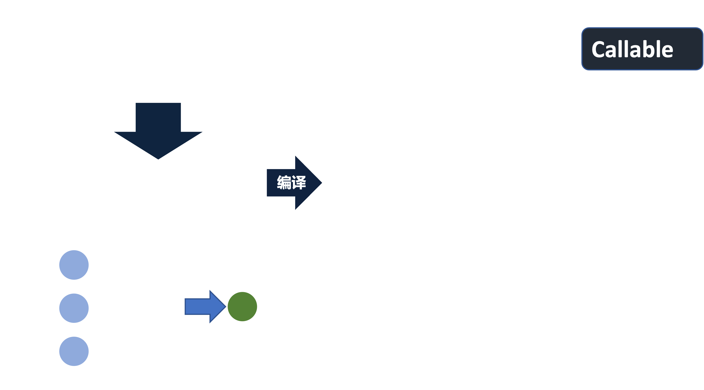

## 3 深度神经网络

深度神经网络是机器学习的一种算法，它用于非结构化数据的预测、识别等非常有效。


神经网络就是我们经常所说的**模型（Model）**，在Tensorflow 2中，一个神经网络通过`Model`来抽象的。

在介绍神经网络API之前，要说明TF 2的神经网络API使用的是Keras，而在Tensorflow 2.x早期版本中，通常使用的是`tf.keras.xxx`，实际上这些API和Keras的API`keras.xxx`是相同的，自然，Keras早就被Google收购了。在Tensorflow 2.9中，可以直接使用`keras.xxx`构建。

### 3.1 `Model`类


`Model`的使用方式有两种：

- 通过继承的方式定义模型

  ```python
  import keras
  import tensorflow as tf
  from keras.layers import Dense
  
  
  class Net(keras.Model):
      def __init__(self):
          super(Net, self).__init__()
          self.hidden_layer = Dense(256, activation='relu')
          self.output_layer = Dense(10, activation='softmax')
  
      def call(self, inputs, training=None, mask=None):
          return self.output_layer(self.hidden_layer(inputs))
  
  model = Net()
  
  x = tf.random.normal([1, 784])
  y = model(x)
  print(y.shape)
  ```

  其中`Dense`表示全连接层。

- 通过函数式API创造一个`Moodel(inputs, outputs, name)`，需要提供输入层和输出层即可。

  ```python
  import tensorflow as tf
  import keras
  from keras.layers import Dense
  
  input_layer = keras.Input(shape=[784,])
  hidden = Dense(256, activation='relu')(input_layer)
  output = Dense(10, activation='softmax')(hidden)
  
  model = keras.Model(inputs=[input_layer, ], outputs=[output, ], name='test_model')
  model.summary()  # Print model structure
  
  x = tf.random.normal([1, 784])
  y = model(x)
  print(y.shape)
  ```

  输出：

  ```shell
  Model: "test_model"
  _________________________________________________________________
   Layer (type)                Output Shape              Param #   
  =================================================================
   input_1 (InputLayer)        [(None, 784)]             0         
                                                                   
   dense (Dense)               (None, 256)               200960    
                                                                   
   dense_1 (Dense)             (None, 10)                2570      
                                                                   
  =================================================================
  Total params: 203,530
  Trainable params: 203,530
  Non-trainable params: 0
  _________________________________________________________________
  (1, 10)
  ```

以上是两种最简单的两种使用方式，接下来详细地对`Model`类进行剖析。

第一：创建模型需要哪些参数：

```python
  def __init__(self, *args, **kwargs):
      # ...
      # Filter the kwargs for multiple inheritance.
      supported_kwargs = ['inputs', 'outputs', 'name', 'trainable', 'skip_init']
      model_kwargs = {k: kwargs[k] for k in kwargs if k in supported_kwargs}
      other_kwargs = {k: kwargs[k] for k in kwargs if k not in supported_kwargs}
      inject_functional_model_class(self.__class__)
      functional.Functional.__init__(self, *args, **model_kwargs)
      # ...

```

首先，创建`Model`可以传入各种各样的参数，然后在`__init__`方法中会将这些参数进行分类为`model_kwargs`和`other_kwargs`。`model_args`支持

- `inputs`：模型的输入。当模型是多输入的时候，可以使用`list`进行传参

- `outputs`：模型的输出。当模型是多输出的时候，可以使用`list`进行传惨

- `name`：模型的名称

- `trainable`：是否是可训练的，比如`Dropout`在训练和测试过程是不同状态的

- `skip_init`：官方的解释如下：

  > Thie is used by the `Model` class, since we have same logic to swap the class in the `__new__` method, which will lead to `__init__` get invoked twice. Use the `skip_init` to skip one of the invocation of `__init__` to aviod any side-effects.
> 核心意思是`__init__`和`__new__`是相同逻辑的，防止执行两次。

了解初始化参数之后，`Model`的属性有：

- `Model`本身的一些属性，就是在定义，创建模型的时候的属性，包括输入、输出信息等
- `Model`训练的一些属性，比如优化器、损失函数、训练策略等



最后就是`Model`的方法